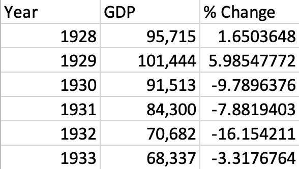

# Group Assignment #3: Great Depression Case Study

## North America: United States

Try to provide a _who, what, when, where, and why_ with a thesis. 2 pages, approximately 5 minutes. Finding useful data will be a challenge.

_"Try and find out what you can about your country"_.

### Useful links

[Great Depression](https://en.wikipedia.org/wiki/Great_Depression)

[Great Depression in the United States](https://en.wikipedia.org/wiki/Great_Depression_in_the_United_States)

[Economy of the United States](https://en.wikipedia.org/wiki/Economy_of_the_United_States)

[Economic History of the United States](https://en.wikipedia.org/wiki/Economic_history_of_the_United_States#1790–2006_GDP)

[GDP/GNP 1919–1994](http://www.huppi.com/kangaroo/GDPreal.htm)

[Unemployment Estimates 1920–1930](https://www.ssc.wisc.edu/~gwallace/Papers/2120839.pdf)

[Labor Force 1929–1939](https://www.bls.gov/opub/mlr/1948/article/pdf/labor-force-employment-and-unemployment-1929-39-estimating-methods.pdf)

[The Depression of the 1930's and Its Origins:
i.e.; The Causes of the Great Depression](https://www.sjsu.edu/faculty/watkins/depression.htm)

[The Money Supply and the Banking System
Before and During the Great Depression](https://www.sjsu.edu/faculty/watkins/depmon.htm)

### Research notes

- great depression began in the U.S.

- began after major fall in stock prices, 09/04/1929

- market crash (Black Tuesday) 10/29/1929

- global GDP fell 15% 1929–1932

- approx 1929–1933, but many countries struggled until WWII

- U.S. unenemployment rose to 23%

- The Federal Reserve System failed to act as [lender of last resort](https://en.wikipedia.org/wiki/Lender_of_last_resort)

- Likely started as demand and gov't spending stagnated, and/or the money supply fell and so credit reduced, bankruptcies.

- Debt deflation (3rd theory):

  1. Debt liquidation and distress selling

  2. Contraction of the money supply as bank loans are paid off

  3. A fall in the level of asset prices

  4. A greater fall in the net worth of business, precipitating bankruptcies.

  5. A fall in profits.

  6. A reduction in output, trade, and employment.

  7. Pessimism and loss of confidence.

  8. Hoarding of money.

  9. A fall in nominal interest rates and a rise in deflation adjusted interest rates.

#### Economic indicators 1929–1932

- Industrial production: -46%

- Wholesale prices: -32%

- Foreign trade: -70%

- Unemployment: +607%

### Some important economic statistics

1. Can we get year by year GDP/GNP numbers? Percentage change by year?

    - GDP in Millions of 1929 Dollars

      

2. Can you get employment rates? Percentage change by year? What share of the country was out of work vs. employed?

    - Unemployment as a percent of civilian labor force (Leber-Gott-BLS):

      - 1928: 4.2% (+0.9%)

      - 1929: 3.2% (-1.0%)

      - 1930: 8.7% (+5.5%)

      - 1931: 15.9% (+7.2%)

      - 1932: 23.6% (+7.7%)

      - 1933: 24.9% (+1.3%)

    - Labor force (thousands of people):

      - 1929: 49,440 (&thickapprox; 1.58m unemployed)

      - 1930: 50,080 (&thickapprox; 4.37m unemployed)

      - 1931: 50,650 (&thickapprox; 8.05m unemployed)

      - 1932: 51,250 (&thickapprox; 12.10m unemployed)

      - 1933: 51,840 (&thickapprox; 12.91m unemployed)

3. Did unemployment and hardship fall differently on women and men? Ethnic or regional variations?

    - Job losses in the U.S. were less severe among women, workers in industries like food and clothing, service and sales workers, and government workers.

    - Unskilled men had a higher unemployment factor.

    - Young people and men over 45 had a hard time finding a job if they didn't have one.

    - Those who moved rural -> urban moved back to rural.

    - Birthrates fell everywhere, children were not financially feasible. Canadian Catholic women used contraception to avoid births.

    - Wives might lose employment if their husband had a job.

    - Rural U.S. women learned how to grow more food in their home gardens and included poultry and eggs.

    - African American women quiltmakers enlarges their operations, promoted collaboration, and trained newcomers. They were created for practical use and creation was an opportunity for camaraderie, socialization, and fulfillment.

    - Job losses were much more severe in light manufacturing and other inner city low-skill work.

4. How did the United States try to deal with the Great Depression? Fiscal policies, social programs, or nothing?

    - The [New Deal](https://en.wikipedia.org/wiki/New_Deal). A series of programs, public work projects, financial reforms, and regulations enacted President FDR between 1933 & 1939.

    - "Second New Deal (1935–1936)" notably added Social Security, arguably the most important aspect of the New Deal. This added retirement pensions, unemployment insurance, and welfare benefits for the disabled. Funded through payroll taxes.

    - Labor Relations Act codified workers rights to collective bargaining through unions of their own choice, stabilizing wages and labor. Labor union membership skyrocketed.

    - Fair Labor Standards Act set maximum weekly hours (44) and minimum wages (25¢). Child labor was forbidden, and those under 18 weren't allowed to do hazardous work. Wages went up, and working hours went down.

5. Can we get a sense of the political and social impact of the Depression on the United States? Did some political parties gain/lose?

    - The New Deal was a major win for FDR's favorability, contributing, along with WWII, to his 3 reelections.

    - The New Deal created policies that last to this day, with Social Security being the most significant.

    - The Democrats won easily in 1932, 34, and 36. Democrats consistently delivered on their promises. Gov't agencies were bolstered which helped people navigate the new social programs.

6. Can you get a sense of the impact on popular culture? Music, movies, literature, painting? Not a typical measure of economic history but it's important. (Hobsbawm 👍🏻)

    - Women famously made clothes out of flour and potato sacs, a now iconic great depression aesthetic.

    - Movies were still a popular passtime throughout the week.

    - _Frankenstein_, _It Happened One Night_, and _Gone With The Wind_&mdash;the highest grossing film of all time&mdash;all premeried during the Great Depression.

    - If you already owned a radio, listening was free.

    - FDR used fireside chat radio conversations to connect with the public about what was going on.

7. When did the United States recover from the Great Depression? This could be tricky to answer.

    - Recovery certainly started in 1940 when the economy mobilized for war production. Total war brought unemployment down below 10%. Businessmen ignored national debt and new taxes, allowing for greater output

## Presentation: "Why?"

I decided to look at was why the Great Depression is said to have started in the U.S. While financial inequality was an international problem at the time, it was especially evident in the United States. Overconfident spending by rich investors in the 1920s led to an excess of borrowing which, when demand dropped as common people couldn't spend money, contributed to massive bank closures, and ultimately shrank the money supply.

> _This graph shows a drop in money supply (M2) closely correlated with a drop in GDP, which indicates the amount of production has dropped._

The result of this drop in demand was a cascade of hesitency and debt liquidation which led to the Wall Street Crash of 1929. Many historians regard this crash as the true beginning of the Great Depression.  Since supply exceeded demand, production dropped, which caused production labor jobs to tank. At the same time, agricultural downturn constricted labor in that industry, furthering the effects of the Depression. According to Thayer Watkins, an economist at San Jose University, had the U.S. Federal Reserve pursued a more open monetary policy by using government securites, a type of loan taken from you, paid back with interest, and backed by taxes, it would have been possible to maintain spending and dampen losses during this time, potentially preventing the Depression.
