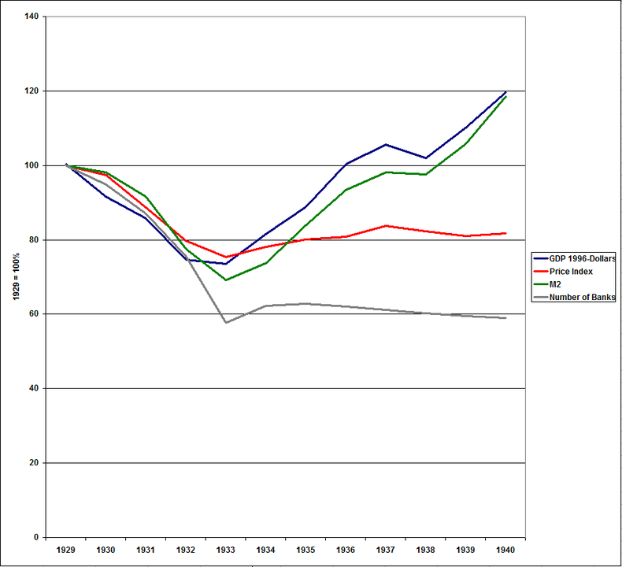
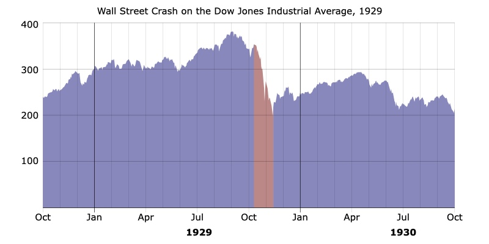

# Group Assignment #3: Great Depression Case Study

## North America: United States

Try to provide a _who, what, when, where, and why_ with a thesis. 2 pages, approximately 5 minutes. Finding useful data will be a challenge.

_"Try and find out what you can about your country"_.

### Useful links

[Great Depression](https://en.wikipedia.org/wiki/Great_Depression)

[Great Depression in the United States](https://en.wikipedia.org/wiki/Great_Depression_in_the_United_States)

[Economy of the United States](https://en.wikipedia.org/wiki/Economy_of_the_United_States)

### Research notes

- great depression began in the U.S.

- began after major fall in stock prices, 09/04/1929

- market crash (Black Tuesday) 10/29/1929

- global GDP fell 15% 1929–1932

- approx 1929–1933, but many countries struggled until WWII

- U.S. unenemployment rose to 23%

- The Federal Reserve System failed to act as [lender of last resort](https://en.wikipedia.org/wiki/Lender_of_last_resort)

- Likely started as demand and gov't spending stagnated, and/or the money supply fell and so credit reduced, bankruptcies.

- Debt deflation (3rd theory):

  1. Debt liquidation and distress selling

  2. Contraction of the money supply as bank loans are paid off

  3. A fall in the level of asset prices

  4. A greater fall in the net worth of business, precipitating bankruptcies.

  5. A fall in profits.

  6. A reduction in output, trade, and employment.

  7. Pessimism and loss of confidence.

  8. Hoarding of money.

  9. A fall in nominal interest rates and a rise in deflation adjusted interest rates.

#### Economic indicators 1929–1932

- Industrial production: -46%

- Wholesale prices: -32%

- Foreign trade: -70%

- Unemployment: +607%

### Some important economic statistics

1. Can we get year by year GDP/GNP numbers? Percentage change by year?

2. Can you get employment rates? Percentage change by year? What share of the country was out of work vs. employed?

3. Did unemployment and hardship fall differently on women and men? Ethnic or regional variations?

4. How did the United States try to deal with the Great Depression? Fiscal policies, social programs, or nothing?

    - The [New Deal](https://en.wikipedia.org/wiki/New_Deal). A series of programs, public work projects, financial reforms, and regulations enacted President FDR between 1933 & 1939.

    - "Second New Deal (1935–1936)" notably added Social Security, arguably the most important aspect of the New Deal. This added retirement pensions, unemployment insurance, and welfare benefits for the disabled. Funded through payroll taxes.

    - Labor Relations Act codified workers rights to collective bargaining through unions of their own choice, stabilizing wages and labor. Labor union membership skyrocketed.

    - Fair Labor Standards Act set maximum weekly hours (44) and minimum wages (25¢). Child labor was forbidden, and those under 18 weren't allowed to do hazardous work. Wages went up, and working hours went down.

5. Can we get a sense of the political and social impact of the Depression on the United States? Did some political parties gain/lose?

6. Can you get a sense of the impact on popular culture? Music, movies, literature, painting? Not a typical measure of economic history but it's important. (Hobsbawm 👍🏻)

7. When did the United States recover from the Great Depression? This could be tricky to answer.
